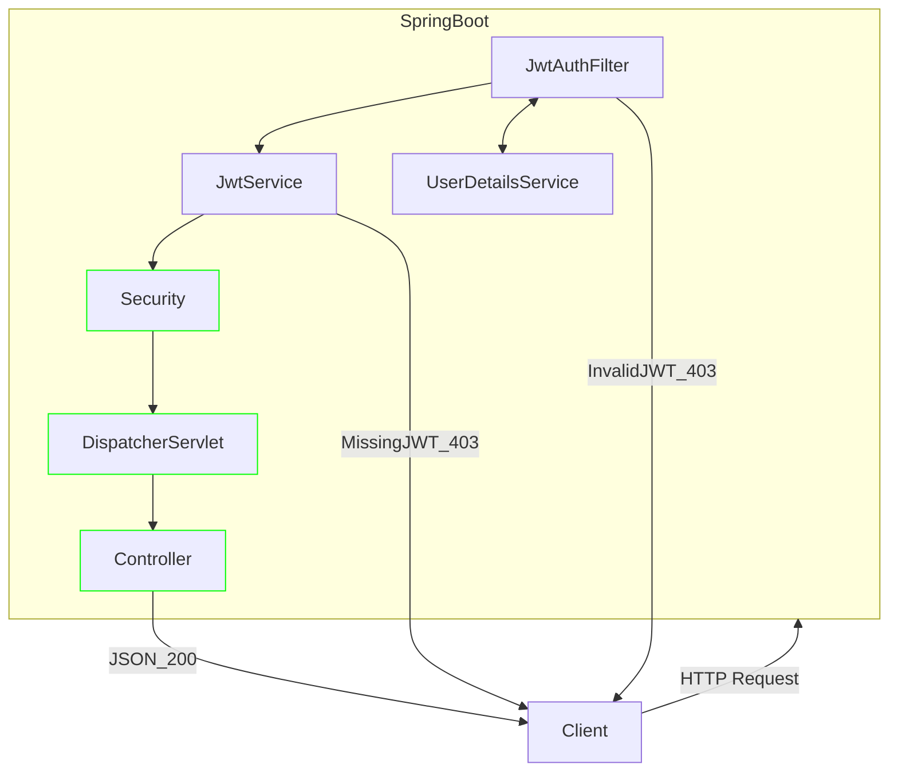

# RestAPI_Practice
Spring Security+JWT Token+RESTAPI

## 개요
- [프로젝트 기간] 2023-09-11 ~ 2023-09-13
- [프로젝트 내용] SpringBoot로 RestAPI 구현하기
- [프로젝트 기여도] 100%
- [프로젝트 링크] [https://github.com/Yeongwookang/RestAPI_Practice.git](https://github.com/Yeongwookang/RestAPI_Practice.git)

## 기술스택
- back-end : ```SpringBoot``` , ```JPA```, ```SpringSecurity```
- DB: ```MySQL```

## 기술을 선정한 이유

### Restful API + JWT 토큰 방식
- 세션을 사용하지 않아도 되서 구현이 단순해짐
- 협업이 편해짐
- RESTful API를 위해서 세션방식을 사용할 수 없었음
- DB 의존적인 구조를 벗어나기 위해



## RESTful API 개발내용
Todo List를 CRUD 해주는 RestfulAPI 개발

## DB 설계
member Table이 전부이다.


## Reference
- 
